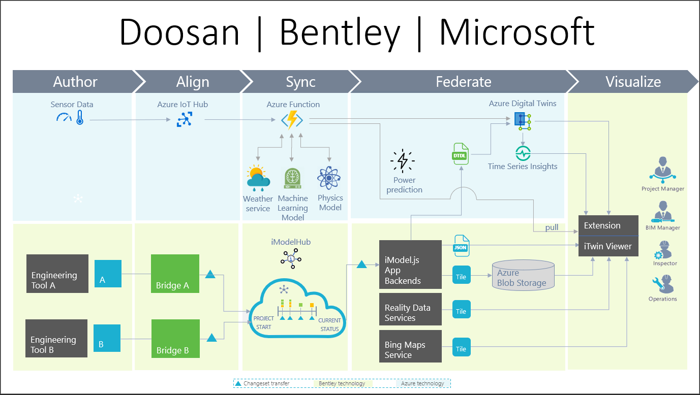

# Windfarm-Iot Hackathon

## About this repository

This hackathon was designed as a proof of concept demonstrating the capabilities of Microsoft's Azure IoT and Azure Digital Twins in conjunction with Bentley Systems' iTwin viewer and iModel services. The diagram above explains the data flow of how this application comes together.

The processes in the light blue background indicate Microsoft technologies, while the grey background indicate Bentley Systems technologies. The application focused in this repository center around three major components:

1) Azure Function
2) iTwin Viewer
3) Windfarm Extension

Note that all data within this project are simulated.

## Overview of file structure

### **1. azure-function**

The azure-function serves as the mediator between IoT Hub and the itwin viewer.

1. Retrieving and  data from IoT Hub.
2. Sending parsed data to Physics Model API to generate predicted physical model power.
3. Sending parsed data to Machine Learning API to generate predicted machine learning model power.
4. Retrieving DTDL from imodeljs and pushing to an ADT instance.
6. Routing weather forecasted data to PM/ML APIs to generate predicted power.

For more a more detailed explanation, please read the README.md in directory azure-function.

### **2. itwin-viewer**

The itwin-viewer is the UI visualizer for the windfarm.

1. Configuring the imodel connection and authorization to use Bentley Systems CONNECT services
2. Render specified models and reality mesh for the windfarm.
3. Load reality data and Bing map to provide terrain graphics.
3. Retrieve data from ADT and emit the data across the application.

For more a more detailed explanation, please read the README.md in directory itwin-viewer.

### **3. windfarm-extension**

This extension adds UI components and functionality to our viewer.

1. Visualize live Iot sensor data and warning/errors from the ADT instance via markers and decorators.
2. Creates an alert system for unexpected power outputs given from Machine and Physics learning models.
3. Provide a historical data via Azure Time Series Insights to visualize past power output readings.
 and predicted power from Physics and Machine Learning Model.

For more a more detailed explanation, please read the README.md in directory windfarm-extension