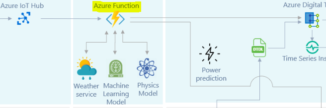

# Explanation of the Azure Function



Written in C#, the azure function serves as the mediator for all data between the IoT Hub and the iTwin Viewer. It calls three external APIs:

1) Machine learning model, which takes parameters Blade 1/2/3 pitch angles, yaw position and wind speed and direction given from IoT to calculated the expected power output of the turbines - called in MLApi.cs.
2) Physics model, which only takes the parameter of the wind speed given from IoT to calculate the expected power - called in PmApi.cs
3) Weather service, which provides the wind speed and direction for next 24 hours of the following day given from an external service, called directly in WindFarmIoT.cs to calculate the predicted machine and physics model expected power output.

File structure breakdown:

- API: This directory contains code to call the machine and physical learning models to produce expected power output.
- WindFarmIot.cs: The bulk of the work done in this file, two functions are created:
  1) "WindFarmIot" - This function is an event hub connection that streams data from the IoT Hub, parses and pushes the data into the ADT instance
  2) "TriggerPrediction" - This function calls the weather forecast API to get forecasted wind speed/direction for tomorrow, and calls the machine learning and physics model api to calculate the expected power for the following day.
- pysical-model-api: Contains sample code on how the physics model endpoint was constructed.
- device-simulation: Contains sample code written in javascript to invoke custom commands on our IoT device simulations.

# Getting Started with the WindFarmIot Azure Function

*NOTE: Instructions provided assuming you have the necessary permissions. The information below was designed for team members of the hackathon, and is retained purely for educational purposes. This code will not work without the appropriate resources and permissions.*

## Environment Variables

NOTE: You won't be able to 

Prior to running the function app locally, you'll need to declare some environment variables:

1. Create "local.settings.json" in root of directory (if running vscode, this should automatically get created with azure function extension)

At a minimum, it should contain:

# ---- local.settings.json example ----
```
{
  "IsEncrypted": false,
  "Values": {
    "AzureWebJobsStorage": "UseDevelopmentStorage=true",
    "FUNCTIONS_WORKER_RUNTIME": "dotnet",
    "EventHubConnectionAppSetting": "Endpoint=sb://..."
  }
}

```
You can retrieve the "EventHubConnectionAppSetting" value from resource "iothub-m6vf5" under "Built-in endpoints"

## How to run

1. Restore the packages required via running `dotnet restore --interactive` in the root of the project
	a. If you're getting permission issues, add a local nuget.config and install the azure artifacts credential provider by running via powershell: 
  ```
  iex "& { $(irm https://aka.ms/install-artifacts-credprovider.ps1) }"
  ```
2. Run a local azure storage emulator to bind to the azure function. A simple emulator is "Microsoft Azure Storage Emulator". You can install and download the software here: https://docs.microsoft.com/en-us/azure/storage/common/storage-use-emulator
3. Ensure local.settings.json exists in the root directory looking similar to above example.
4. You may need to run "Set-ExecutionPolicy -Scope Process -ExecutionPolicy Bypass"
5. "Run" the code in your IDE. 

You can run it manually via command prompt:

```
dotnet.exe clean /property:GenerateFullPaths=true /consoleloggerparameters:NoSummary

dotnet.exe build /property:GenerateFullPaths=true /consoleloggerparameters:NoSummary

func host start
```

6. If server is on "Now listening...", you'll need to run the simulation device to start getting data via:
https://windfarmsimulation-m6vf5.azurewebsites.net/simulations/be194ffa-ae02-4d98-86a5-eed61628c27d/befc2d4d-1093-4a29-aa99-a778e26cc128

