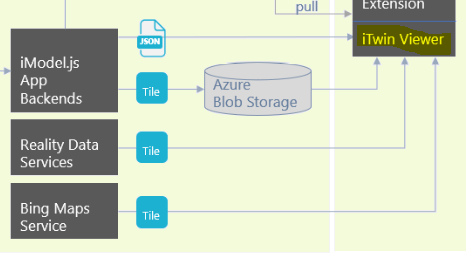

# Explanation of the iTwin Viewer



Written in typecript, the [itwin-viewer](https://github.com/imodeljs/itwin-viewer) is a publicly available npm package that serves as the template for an iModel.js viewer. This directory contains all the information required to load the imodel that we have uploaded to Bentley Systems CONNECT cloud service.

Note that most of the files in src are automatically generated when installing the @bentley/itwin-viewer package, please refer to this link to learn more: https://github.com/imodeljs/itwin-viewer

Notable Files in src:

- App.tsx: Component "Viewer" is the main react component where we configure which iModel to connect to and control some UI like the status bar and tool settings. We define some view styles here, load the reality terrain data and attach event listeners to our ADT instance here.
- AdtdataLink.ts: Our routing for our ADT instance host. In conjunction with "setupProxy.js", any route following "digitaltwins" gets forwarded to our Azure ADT instance. We call the endpoint for the specific dtId (i.e. WTG001) to pull all the data for the specified turbine.

The app polls the ADT instance every 10 seconds and emits the data to all the event listeners that are used throughout the application, including the extension. The bulk of the custom UI components are defined in our [windfarm-extension](https://github.com/iModeljs-meets-AzureDT/windfarm-iot/tree/main/windfarm-extension) directory. When the app runs, it loads all the extensions in our build/imjs_extensions directory.

# Getting Started with the itwin-viewer

*NOTE: Instructions provided assuming you have the necessary permissions. The information below was designed for team members of the hackathon, and is retained purely for educational purposes. This code will not work without the appropriate resources and permissions.*

This project was bootstrapped with [Create React App](https://github.com/facebook/create-react-app).

## Quickstart

1. npm install
2. npm start
3. Start the local backend instance, your imodels won't load without this step.
- cd into windfarm-iot/local-backend
- npm install
- npm run build
- npm run start
4. (recommended to load extension):
- cd into windfarm-iot/winfarm-extension
- npm install
- npm run watch

## Environment Variables

For this Project, these environment variables have already been filled so please skip this section if you intend on using the default models.

Prior to running the app, add a valid contextId and iModelId for your user in the .env file:

```
# ---- Test ids ----
REACT_APP_TEST_CONTEXT_ID = ""
REACT_APP_TEST_IMODEL_ID = ""
```

You can also replace the OIDC client data in this file with your own if you'd prefer.

## Available Scripts

In the project directory, you can run:

### `npm start`

Runs the app in the development mode.\
Open [http://localhost:3000](http://localhost:3000) to view it in the browser.

The page will reload if you make edits.\
You will also see any lint errors in the console.

### `npm test`

Launches the test runner in the interactive watch mode.\
See the section about [running tests](https://facebook.github.io/create-react-app/docs/running-tests) for more information.

### `npm run build`

Builds the app for production to the `build` folder.\
It correctly bundles React in production mode and optimizes the build for the best performance.

The build is minified and the filenames include the hashes.\
Your app is ready to be deployed!

See the section about [deployment](https://facebook.github.io/create-react-app/docs/deployment) for more information.

### `npm run eject`

**Note: this is a one-way operation. Once you `eject`, you can’t go back!**

If you aren’t satisfied with the build tool and configuration choices, you can `eject` at any time. This command will remove the single build dependency from your project.

Instead, it will copy all the configuration files and the transitive dependencies (webpack, Babel, ESLint, etc) right into your project so you have full control over them. All of the commands except `eject` will still work, but they will point to the copied scripts so you can tweak them. At this point you’re on your own.

You don’t have to ever use `eject`. The curated feature set is suitable for small and middle deployments, and you shouldn’t feel obligated to use this feature. However we understand that this tool wouldn’t be useful if you couldn’t customize it when you are ready for it.

## Learn More

You can learn more in the [Create React App documentation](https://facebook.github.io/create-react-app/docs/getting-started).

To learn React, check out the [React documentation](https://reactjs.org/).
