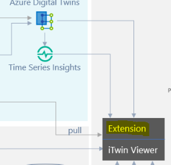

# Getting Started with the extension

Extensions add functionality and UI to the itwin-viewer.

## Quickstart

1. npm install
2. npm run watch

## Description

On build, extensions create a lib folder named "imjs_extensions/<extension_name>" that our itwin-viewer uses if registered in the itwin app. This sample provides a way to add buttons to the itwin-viewer.

watch was added to automatically move the build files into the itwin-viewer. This provides a more seamless experience during development.

## On turbine blade animation

All the files relevant to the animation are in the src\animation directory.  The method used in this project is very specific and should be considered more of a technical "proof-of-concept" for improvement rather than a method to be followed.  For a better understanding of what when into rotation the blades read the comments at the top of the [TimelineCreatorTool.ts](https://github.com/iModeljs-meets-AzureDT/windfarm-iot/windfarm-extension/src/animation/TimelineCreatorTool.ts).  The only file needed for running the app is [AnimationTimer.ts](https://github.com/iModeljs-meets-AzureDT/windfarm-iot/windfarm-extension/src/animation/AnimationTimer.ts).
