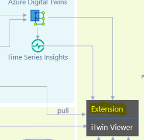

# Explanation of the iTwin Viewer

Extensions are a modular approach to adding functionality and UI to the itwin-viewer. This directory handles all the custom components designed specifically for this hackathon, namely these four components:

1) Live IoT data visualization, represented as markers and decorators that appear above each wind turbine.
2) Historical data via a Time Series Insights widget that appears below the viewport, showing the power output within a 2 hour or 15 minute interval.
3) Alerts that appear when unexpected calculated machine learning/physicals model power values have a high difference than the actual readings from the IoT device.
4) Clock indicating the current time and provides the 'power prediction' mode that predicts the power output of the next 24 hours of the following day.

File structure breakdown:

- animation: This directory contains sample code to provide the spinning animation of the wind turbines.
- client: Code showing the connection to our Azure TSI instance and Azure function.

components:
- alerts: Code for showing the 'alerts' on our widget to the right. These alerts automatically show up if the actual IoT reading has a > 50% difference from either the physics or machine learning models.
- clock: Code to display the movable clock and toggle for the power prediction mode.
- decorators/markers: Code to provide the floating boxes above the wind turbines to provide the live data feed from the ADT instance.
- time-series: Code that displays the widget that shows historical data graphs from Time Series Insights in the bottom widget.

WindfarmExtension.tsx: The main extension file that initializes all required components for our custom UI.

# Getting Started with the extension

*NOTE: Instructions provided assuming you have the necessary permissions. The information below was designed for team members of the hackathon, and is retained purely for educational purposes. This code will not work without the appropriate resources and permissions.*

## Quickstart

1. npm install
2. npm run watch

## Description

On build, extensions create a lib folder named "imjs_extensions/<extension_name>" that our itwin-viewer uses if registered in the itwin app. This sample provides a way to add buttons to the itwin-viewer.

watch was added to automatically move the build files into the itwin-viewer. This provides a more seamless experience during development.

## On turbine blade animation

All the files relevant to the animation are in the src\animation directory.  The method used in this project is very specific and should be considered more of a technical "proof-of-concept" for improvement rather than a method to be followed.  For a better understanding of what when into rotation the blades read the comments at the top of the [TimelineCreatorTool.ts](https://github.com/iModeljs-meets-AzureDT/windfarm-iot/windfarm-extension/src/animation/TimelineCreatorTool.ts).  The only file needed for running the app is [AnimationTimer.ts](https://github.com/iModeljs-meets-AzureDT/windfarm-iot/windfarm-extension/src/animation/AnimationTimer.ts).
